<p align='center'>
  <a href='https://sapi-app.now.sh'>
    
    <h3 align='center'>Sapi</h3>
  </a>
  <p align='center'>Meet your food buddy 😋</p>
</p>


## Features
Sapi is an app for finding food buddies. Think of it as a cross between Tinder and Yelp, you'll have both great conversations and tasty food on Sapi!

- Meet new people nearby, check out their favourite foods, and send a spoon 🥄 (you can think of it as a like 😉) then start up a new conversation
- Find restaurants to meet up with your food buddies and have a great conversation
- Carry on your conversations on the app then check out your incoming spoons and send back some re-spoons
- Add details about yourself to your profile including a bio, favourite foods, and eating styles


## Documentation
- [Codebase Overview](#codebase-overview)
- [Tech Decisions](#tech-decisions)
- [How to Develop](#how-to-develop)
- [Screenshots](#screenshots)
- [FAQ](#faq)


## Codebase Overview
This section gives an overview of the codebase structure.

### Top-level folders
- [`server`](server/) backend deployment and configuration files
- [`client`](client/) frontend codebase and serverless functions

### [`server`](server/) folder
- [`docker-compose.yaml`](server/docker-compose.yaml) orchestration of GraphQL-Engine and Caddy containers
- [`Caddyfile`](server/Caddyfile) Caddy config file to make the GraphQL endpoint available over HTTPS
- [`.env.template`](server/.env.template), [`.env.graphql-engine.template`](server/.env.graphql-engine.template), [`.env.caddy.template`](server/.env.caddy.template) environment variable template files for Docker containers
- [`migrate/`](server/migrate/) folder containing PostgreSQL migrations and GraphQL-Engine metadata
- [`auth0/`](server/auth0/) folder containing Auth0 Rules for connecting Auth0 to Hasura GraphQL-Engine

### [`client`](client/) folder
- [`src/`](client/src/) folder containing Next.js codebase
- [`codegen.yaml`](client/codegen.yaml), [`schemagen.yaml`](client/schemagen.yaml), [`allowlistgen.yaml`](client/allowlistgen.yaml) config files for GraphQL Code Generator
- [`apollo.config.js`](client/apollo.config.js) config file for the [Apollo GraphQL extension](https://marketplace.visualstudio.com/items?itemName=apollographql.vscode-apollo) for vscode to provide intellisense for GraphQL queries
- [`next.config.js`](client/next.config.js) Next.js config file
- [`package.json`](client/package.json) project dependencies, scripts, babel config, et cetera


## Tech Decisions
This section details the decisions behind the tech stack.

### Backend
- [Hasura GraphQL-Engine](https://github.com/hasura/graphql-engine) was chosen due to the robust set of features, extensive configuration, and instant zero-config GraphQL API provided ontop of a PostgreSQL database
- [Caddy](https://github.com/caddyserver/caddy) minimal-config reverse proxy server with Automatic HTTPS
- [Auth0](https://auth0.com/) secure authentication service that comes with integration with Hasura and Next.js

### Frontend
- [Next.js](https://nextjs.org) was chosen as the frontend React-based framework due to the included flexible routing system and static-site generation. The following packages are used client-side:
  - [`@auth0/nextjs-auth0`](https://github.com/auth0/nextjs-auth0) interoperability between Auth0 and Next.js
  - [`framer-motion`](https://github.com/framer/motion) animation library with intuitive API and physics-based animations
  - [`linaria`](https://github.com/callstack/linaria) CSS-in-JS library with a familiar Styled Components / Emotion API plus static CSS extraction
  - [`recoil`](https://github.com/facebookexperimental/Recoil) highly flexible React state management system
  - [`urql`](https://github.com/FormidableLabs/urql) lightweight React hooks based GraphQL client

- Development Tools
  - [GraphQL Code Generator](https://github.com/dotansimha/graphql-code-generator) utility for generating typed GraphQL queries / mutations / subscriptions


## How to Develop
This section will guide you through setting up a development environment.

### Development Prerequisites
1. Yelp API Key [Instructions](https://www.yelp.com/developers/documentation/v3/authentication)
2. Google Maps API Key [Instructions](https://developers.google.com/maps/documentation/embed/get-api-key#get-the-api-key)
3. Auth0 Application Setup [Instructions](https://github.com/auth0/nextjs-auth0#getting-started)
4. Auth0 + Hasura GraphQL-Engine Integration [Instructions](https://hasura.io/docs/1.0/graphql/manual/guides/integrations/auth0-jwt.html)
5. Environment Variables entered into `.env-cmdrc.json` using [`.env-cmdrc.template.json`](client/.env-cmdrc.template.json) as a starting point (remember to remove `.template` from the filename) containing the following key value pairs 👇

#### Env Template
``` json
{
  "dev": {
    "AUTH0_DOMAIN": "[Auth0 Domain]",
    "AUTH0_CLIENT_ID": "[Auth0 Client ID]",
    "AUTH0_CLIENT_SECRET": "[Auth0 Client Secret]",
    "AUTH0_SCOPE": "[Auth0 Scope]",
    "AUTH0_REDIRECT": "[Post-login URL redirect]",
    "AUTH0_LOGOUT_REDIRECT": "Post-logout URL redirect",
    "AUTH0_SESSION_COOKIE_SECRET": "[Secret used to encrypt the session cookie]",
    "NEXT_PUBLIC_GOOGLE_MAPS_APIKEY": "[Google Maps API Key]",
    "NEXT_PUBLIC_GRAPHQL_ENDPOINT": "[GraphQL server endpoint]"
  },
  "graphql": {
    "NEXT_PUBLIC_GRAPHQL_ENDPOINT": "[GraphQL server endpoint]",
    "GRAPHQL_ENDPOINT_HEADER_NAME": "X-Hasura-Admin-Secret",
    "GRAPHQL_ENDPOINT_HEADER_VALUE": "[Hasura Admin Secret]"
  }
}
```

### Development Setup
This project uses [`pnpm`](https://github.com/pnpm/pnpm) although you may use your preferred package manager ([`npm`](https://github.com/npm/cli) / [`yarn`](https://github.com/yarnpkg/yarn))

Follow these steps to setup a development environment:

#### Backend
1. Register a domain name which will point to your GraphQL server
2. Deploy a PostgreSQL instance on AWS RDS [Instructions](https://docs.aws.amazon.com/AmazonRDS/latest/UserGuide/CHAP_GettingStarted.CreatingConnecting.PostgreSQL.html#CHAP_GettingStarted.Creating.PostgreSQL)
3. Deploy a Linux instance on AWS EC2 [Instructions](https://docs.aws.amazon.com/AWSEC2/latest/UserGuide/EC2_GetStarted.html#ec2-launch-instance)
4. Ensure that your RDS and EC2 instances are on the same [VPC](https://docs.aws.amazon.com/AmazonRDS/latest/UserGuide/USER_VPC.Scenarios.html#USER_VPC.Scenario1) to allow communication between them
5. SSH into your EC2 instance [Instructions](https://docs.aws.amazon.com/AWSEC2/latest/UserGuide/AccessingInstancesLinux.html)
6. Clone this repo
7. In the [`server`](server/) folder remove the `.template` suffix from the [`.env.template`](server/.env.template), [`.env.graphql-engine.template`](server/.env.graphql-engine.template), and [`.env.caddy.template`](server/.env.caddy.template) files and add your environment variables
8. Run `sudo docker-compose up` to start the GraphQL-Engine and Caddy containers
9. In the [`migrate`](server/migrate/) folder remove the `.template` suffix from the [`.env.template`](server/migrate/.env.template) file and add your environment variables
10. Install the Hasura CLI `npm add -g hasura-cli` then run `hasura migrate apply` and `hasura metadata apply`

#### Frontend
11. `npm run gen:s` generate a local copy of the GraphQL schema
12. `npm run gen` generate the GraphQL Operation files into [`client/src/operations`](client/src/operations)
13. `npm run dev` start a local Next.js development server


## Screenshots

### Home
<div style='display:flex;'>
  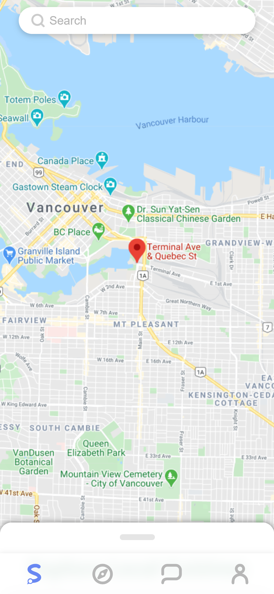
  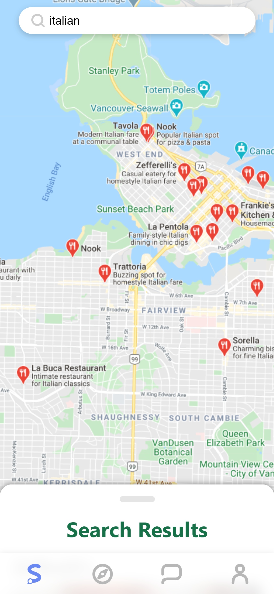
  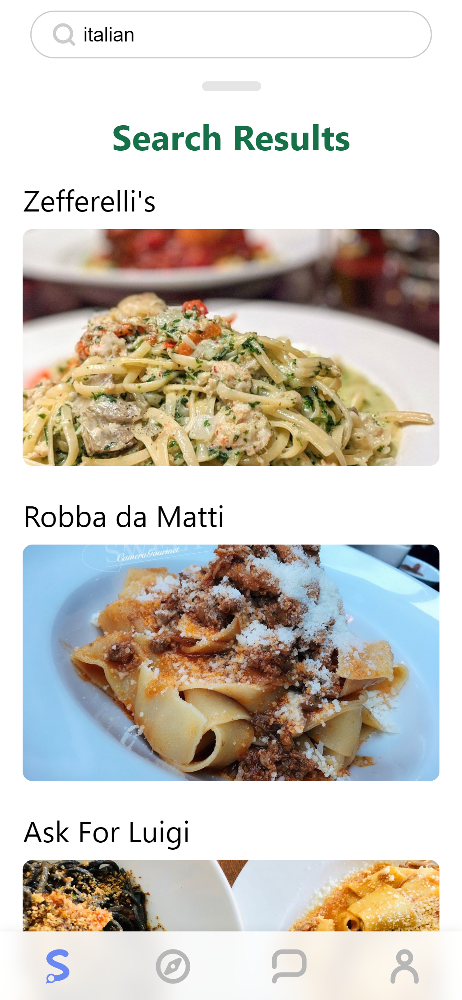
  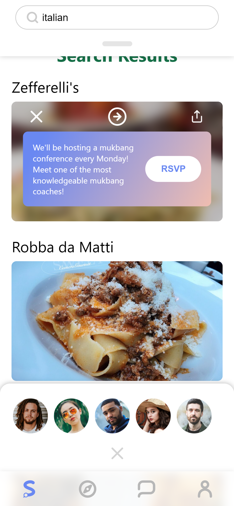
  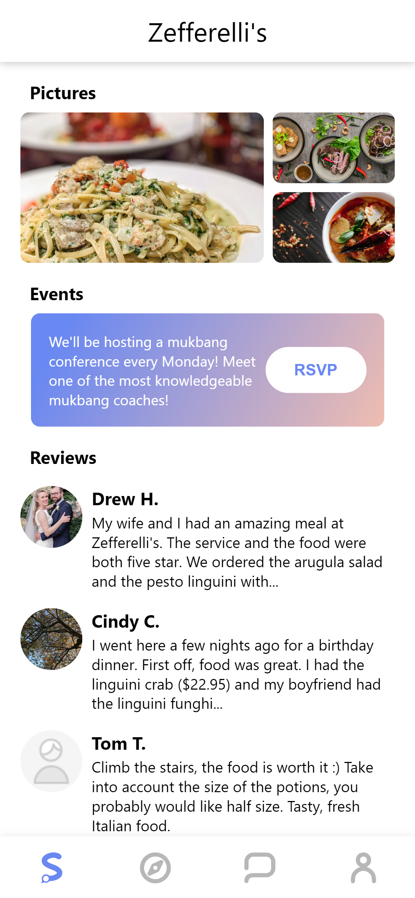
</div>

### Nearby
<div style='display:flex;'>
  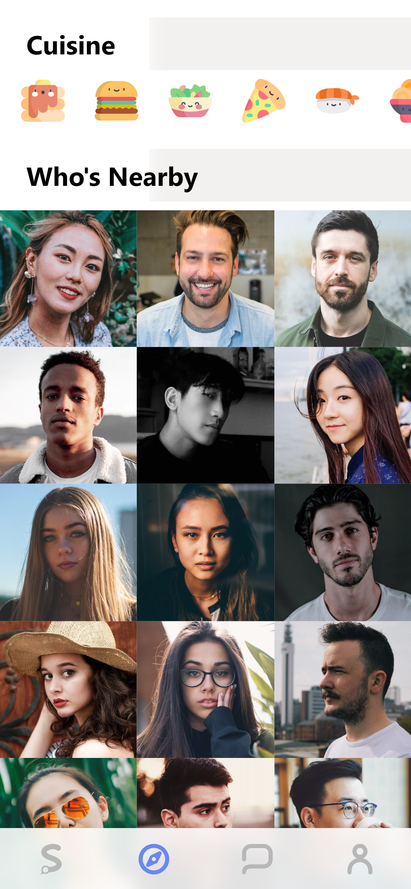
  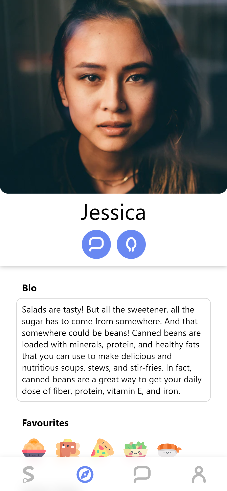
  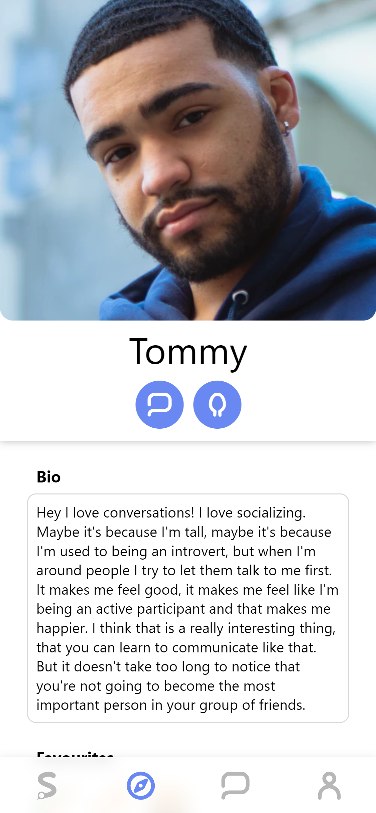
</div>

### Conversations
<div style='display:flex;'>
  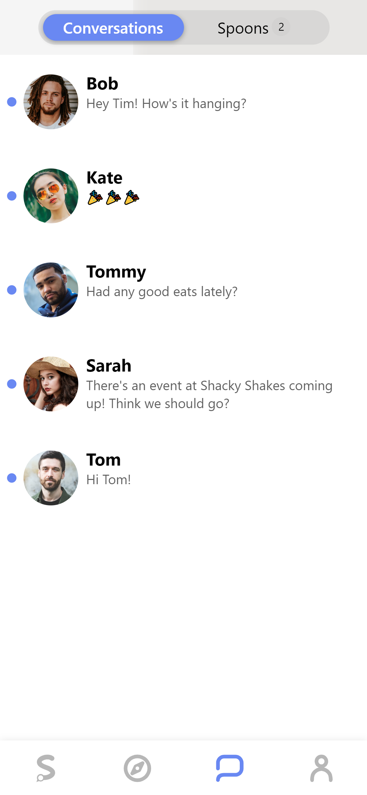
  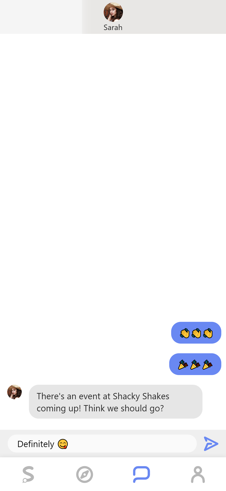 
  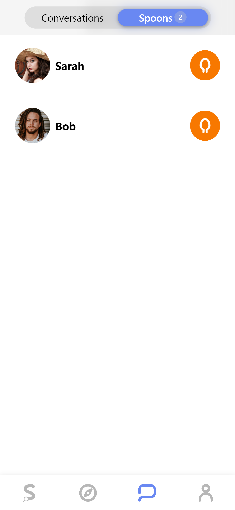
</div>

### Profile
<div style='display:flex;'>
  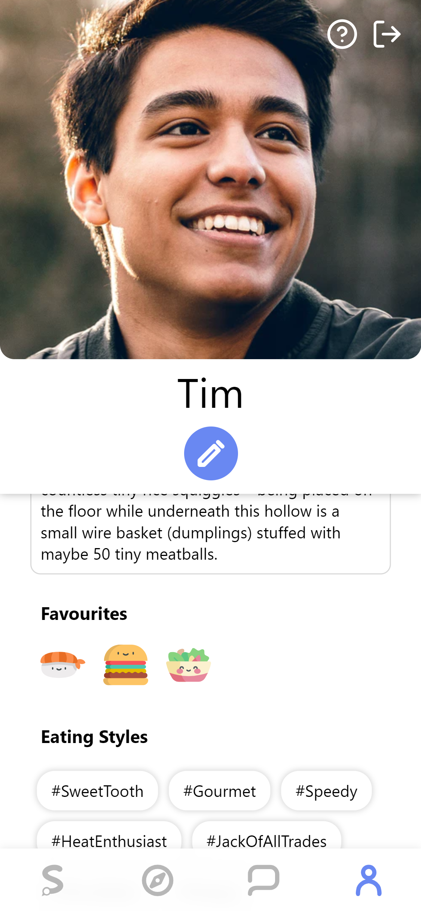
</div>


## FAQ
- *Q: Why is it called Sapi?*
  - *A:* The name, *Sapi*, is derived from the Latin word, *sapidus*, meaning *tasty*.
